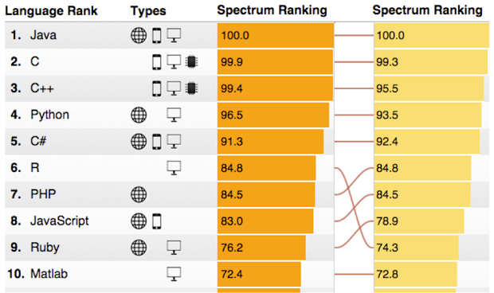

## Today's Agenda

>- Evidence Based Management
>- Data Science
>- 
**Your accomplishments at the end of the seminar**

>- Installation of R and RStudio
>- Example: Working with R
>- Learning R with swirl

# Motivation for this Course

## Evidence Based Management

"... the idea that decisions ... should be based on the latest and best knowledge of what actually works" [Pfeffer & Sutton, 2006](https://hbr.org/2006/01/evidence-based-management)

Why is it hard?

>- There's too much evidience
>- There's not enough good evidence
>- The evidence doesn't quite apply
>- People are trying to mislead you
>- You are trying to mislead you
>- The side effects outweigh the cure
>- Stories are more persuasive anyway

## Evidence Based Management

Typical research process in EBMgt is similar to academic research.

[Lehner & Farthofer, 2012](http://www.lindeverlag.at/titel-56-56/evidenzbasiertes_management-4741/)

## NASA: Evidience Based Customer Service

## Big Data {.flexbox .vcenter}

In 2010, the [Economist](http://www.economist.com/node/15579717) published the article **"The data deluge"**.

"Businesses, governments and society are only starting to tap its vast potential."

---

## What is Data Science?

[Drew Conway: Data Science Through the Lens of Social Science](http://www.drewconway.com/zia/?p=2378)

## Why R? The Big Picture {.build}

>- R is becoming the “lingua franca” of data science
>- Companies are using R (Google, Facebook, Microsoft)
>- R is [popular in academia](http://www.nature.com/news/programming-tools-adventures-with-r-1.16609)

[Sharp Sight Labs, 2015](http://www.r-bloggers.com/why-you-should-learn-r-first-for-data-science/)

## IEEE 2015 Ranking of Programming Languages

 

[IEEE Spectrum](http://spectrum.ieee.org/computing/software/the-2015-top-ten-programming-languages)

## Why ? The Hands-On View

>- It is free
>- It has a comprehensive set of packages
    * Data access
    * Data cleaning
    * Analysis
    * Data reporting
>- It has one of the best development environments - Rstudio [http://www.rstudio.com/](http://www.rstudio.com/)
>- It has an amazing ecosystem of developers
>- Packages (i.e. extensions) are easy to install and "play nicely together"

   
# Acknowledgements

## Acknowledgements

This class and many slides were inspired by:

**Brian Caffo, Jeff Leek, and Roger Peng**   
Department of Biostatistics   
Johns Hopkins Bloomberg School of Public Health   

and the  

[ Data Science Specialization Program](https://www.coursera.org/specialization/jhudatascience/1?utm_medium=courseDescripTop)

