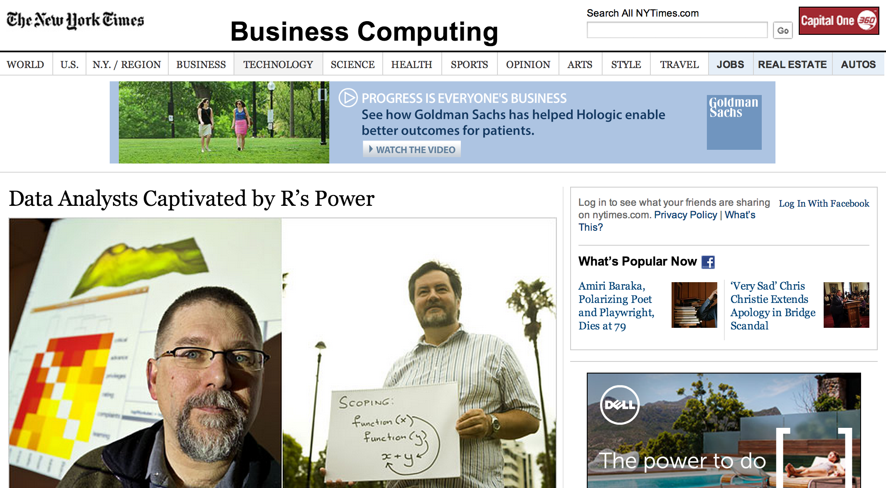

<style>
table.rmdtable th {
  color: white;
  font-size: 18px;
  background: -webkit-gradient(linear, 50% 0%, 50% 100%, color-stop(40%, #1e786d), color-stop(80%, #144f48)) no-repeat;
  background: -webkit-linear-gradient(top, #1e786d 40%, #144f48 80%) no-repeat;
  background: -moz-linear-gradient(top, #1e786d 40%, #144f48 80%) no-repeat;
  background: -o-linear-gradient(top, #1e786d 40%, #144f48 80%) no-repeat;
  background: linear-gradient(top, #1e786d 40%, #144f48 80%) no-repeat;
}
</style>


## Course Schedule
  
| Date  | Time        | Room       | Topic                                                    |
|------:| ----------- | ---------- | ---------------------------------------------------------|
| 20.4. | 13:45—17:00 | MT 127     | Seminar overview, introduction to programming language R |                         
| 27.4. | 13:45—17:00 | MT 127     | Reproducible research, knitr                             |
| 11.5. | 13:45—17:00 | MT 127     | Descriptive data analysis, ggplot                        |
| 18.5. | 13:45—17:00 | MT 127     | Statistical inference                                    |
|  1.6. | 13:45—17:00 | MT 127     | Regression models                                        |
|  8.6. | 13:45—17:00 | MT 127     | Team Presentations                                       |


## Recommended Reading

1. David Diez, Cristopher Barr, and Mine Çetinkaya-Rundel (2014). **Introductory Statistics with Randomization and Simulation.**   
   A free PDF version is available at www.openintro.org.  

2. Nina Zumel and John Mount (2014). **Practical Data Science with R.**   

3. Pervez N. Ghauri and Kjell Grønhaug (2010). **Research Methods in Business Studies.**   
    Some copies are available in the JKU library.  

4. Alternatively, for German speakers:  
   Johannes M. Lehner and Alois Farthofer (2012). **Evidenzbasiertes Management.**


## Motivation for this Course


## Why data science?

<div class="centered">

</div>


[http://www.economist.com/node/15579717](http://www.economist.com/node/15579717)


## Why data science?

<div class="centered">

</div>


[http://www.mckinsey.com/insights/business_technology/big_data_the_next_frontier_for_innovation](http://www.mckinsey.com/insights/business_technology/big_data_the_next_frontier_for_innovation)


## Why statistical data science?

<div class="centered">

</div>

[http://www.nytimes.com/2009/08/06/technology/06stats.html?_r=0](http://www.nytimes.com/2009/08/06/technology/06stats.html?_r=0)


## What is Data Science?

<div class="centered">

</div>

[Drew Conway](http://www.drewconway.com/zia/?p=2378)


## Why R? 

<div class="centered">

</div>

[http://www.nytimes.com/2009/01/07/technology/business-computing/07program.html?pagewanted=all](http://www.nytimes.com/2009/01/07/technology/business-computing/07program.html?pagewanted=all)


## Why R? 

* It is free
* It has a comprehensive set of packages
  * Data access
  * Data cleaning
  * Analysis
  * Data reporting
* It has one of the best development environments - Rstudio [http://www.rstudio.com/](http://www.rstudio.com/)
* It has an amazing ecosystem of developers
* Packages are easy to install and "play nicely together"


## Who is a data scientist?


<div class="centered">

</div>

[Hilary Mason](http://www.hilarymason.com/)


## Who is a data scientist?

<div class="centered">

</div>

[Daphne Koller](http://ai.stanford.edu/~koller/)


## Who is a data scientist?

<div class="centered">

</div>

[Nate Silver](http://fivethirtyeight.blogs.nytimes.com/)


## Sample Plot

```{r sales, fig.height=6, fig.width=8, fig.align='center'}
year <- 2006:2015; sales <- (1:10)^1.8
plot(year, sales, "l", col="red")
```


## Reproducible Research


## Descriptive Data Analysis


## Statistical Inference


## Regression Analysis


--- .segue .dark

## References

$$\frac{-b \pm \sqrt{b^2 - 4 a c}}{2a}$$
