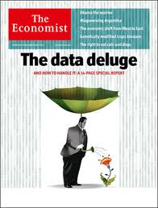
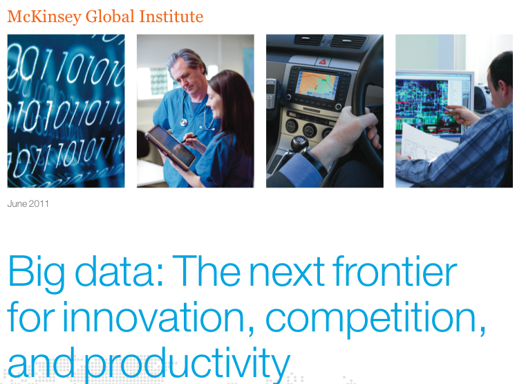
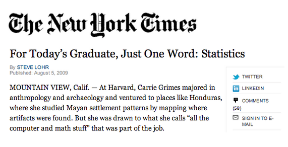

## Course Schedule
  
| Date  | Time        | Room       | Topic                                                    |
|------ | ----------- | ---------- | ---------------------------------------------------------|
| 20.4. | 13:45—17:00 | MT 127     | Seminar overview, introduction to programming language R |                         
| 27.4. | 13:45—17:00 | MT 127     | Reproducible research, knitr                             |
| 11.5. | 13:45—17:00 | MT 127     | Descriptive data analysis, ggplot                        |
| 18.5. | 13:45—17:00 | MT 127     | Statistical inference                                    |
|  1.6. | 13:45—17:00 | MT 127     | Regression models                                        |
|  8.6. | 13:45—17:00 | MT 127     | Team Presentations                                       |

--- 

## Recommended Reading

1. David Diez, Cristopher Barr, and Mine Çetinkaya-Rundel (2014). **Introductory Statistics with Randomization and Simulation.** First Edition. CreateSpace Independent Publishing Platform.  
   A free PDF version is available at www.openintro.org.  

2. Nina Zumel and John Mount (2014). **Practical Data Science with R.** Manning Publications Company.  

3. Pervez N. Ghauri and Kjell Grønhaug (2010). **Research Methods in Business Studies.** 4th Edition. Financial Times Prentice Hall.  
    Some copies are available in the JKU library.  

4. Alternatively, for German speakers:  
   Johannes M. Lehner and Alois Farthofer (2012). **Evidenzbasiertes Management.** Methoden und Kompetenzen der Organisationsanalyse. Mit einführenden Beispielen zu R, Mathematica und SPSS. Wien: Linde Verlag.

---

## Motivation for this Course

---

## Why data science?



[http://www.economist.com/node/15579717](http://www.economist.com/node/15579717)


---

## Why data science?



[http://www.mckinsey.com/insights/business_technology/big_data_the_next_frontier_for_innovation](http://www.mckinsey.com/insights/business_technology/big_data_the_next_frontier_for_innovation)

--- 

## Why statistical data science?



[http://www.nytimes.com/2009/08/06/technology/06stats.html?_r=0](http://www.nytimes.com/2009/08/06/technology/06stats.html?_r=0)


---

## Why R? 

 

[http://www.nytimes.com/2009/01/07/technology/business-computing/07program.html?pagewanted=all](http://www.nytimes.com/2009/01/07/technology/business-computing/07program.html?pagewanted=all)

---

## Why R? 

* It is free
* It has a comprehensive set of packages
  * Data access
  * Data cleaning
  * Analysis
  * Data reporting
* It has one of the best development environments - Rstudio [http://www.rstudio.com/](http://www.rstudio.com/)
* It has an amazing ecosystem of developers
* Packages are easy to install and "play nicely together"


---

## Who is a data scientist?


[Daryl Morey](http://en.wikipedia.org/wiki/Daryl_Morey)


---

## Who is a data scientist?


[Hilary Mason](http://www.hilarymason.com/)


---

## Who is a data scientist?


[Daphne Koller](http://ai.stanford.edu/~koller/)


---

## Who is a data scientist?

 

[Nate Silver](http://fivethirtyeight.blogs.nytimes.com/)

---

## What is Data Science?

 


[Drew Conway](http://www.drewconway.com/zia/?p=2378)

---

## Sample Plot

```{r sales, fig.height=6, fig.width=8, fig.align='center'}
year <- 2006:2015; sales <- (1:10)^1.8
plot(year, sales, "l", col="red")
```

---

## Reproducible Research


---

## Descriptive Data Analysis

---

## Statistical Inference

---

## Regression Analysis

---

--- .segue .dark

## References

$$\frac{-b \pm \sqrt{b^2 - 4 a c}}{2a}$$
