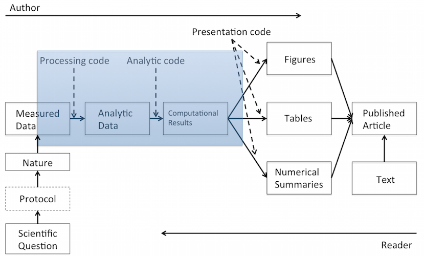

## Today's Agenda

- Reproducible Research
- markdown
- knitr
- R Markdown Example
- Assignments

## Acknowledgements

\
\
\

This class and many slides were inspired by:

**Brian Caffo, Jeff Leek, and Roger Peng**   
Department of Biostatistics   
Johns Hopkins Bloomberg School of Public Health   

and the  

[Coursera Data Science Specialization Program](https://www.coursera.org/specialization/jhudatascience/1?utm_medium=courseDescripTop)

# Reinhart & Rogoff (2010) | Example of an error with consequences

## Seminal Paper {.smaller}

\
\

[Reinhart, Carmen M.; Rogoff, Kenneth S. (2010). "Growth in a Time of Debt".  
American Economic Review 100 (2): 573–78.](http://www.nber.org/papers/w15639.pdf?new_window=1)

## The Claim {.smaller}

The paper argues that when "gross external debt reaches 60 percent of GDP",
a country' annual growth declined by two percent, and
"for levels of external debt in excess of 90 percent" GDP growth was "roughly cut in half."

## Political Impact

Appearing in the aftermath of the financial crisis of 2007–2008, the paper provided support for pro-austerity policies.

Politicians, commentators, and activists widely cited the paper in political debates over the effectiveness of austerity in fiscal policy for debt-burdened economies. 

## Replication Study

Thomas Herndon was a Ph.D. student at the University of Massachusetts Amherst. 

His class assignment - pick an economics paper and see if you can replicate the results.

## The Error

## Difference in Results

## Conclusions

>- Do replication studies — you might get famous!
>- Don't use Excel ;-)
>- Publish your data and analysis tools together with the paper

# Reproducible Research

## Replication and Reproducibility

**Replication is the gold standard**

* New investigators, data, analytic methods, laboratories, instruments, etc.

* Focuses on the validity of the scientific claim

* "Is this claim true?"

* The ultimate standard for strengthening scientific evidence

* Particularly important in studies that can impact broad policy or
  regulatory decisions

## Replication and Reproducibility

**Reproducibility**

* Focuses on the validity of the data analysis

* "Can we trust this analysis?"

* Arguably a minimum standard for any scientific study

* New investigators, same data, same methods

* Important when replication is impossible

## What is Reproducible Research?

## What is Reproducible Research?

## What Problem Does Reproducibility Solve?

**What we get**

* Transparency
* Data Availability
* Software / Methods Availability
* Improved Transfer of Knowledge

## What Problem Does Reproducibility Solve?

**What we get**

* Transparency
* Data Availability
* Software / Methods Availability
* Improved Transfer of Knowledge

**What we do NOT get**

* Validity / Correctness of the analysis

An analysis can be reproducible and still be wrong

# Reproducible Research in Practice

## NASA Earth Exchange

---

## Reproducibility in Management Research

## Reproducibility in Cancer Research

**Great (and quite serious) case study:**

[The Importance of Reproducible Research in High-Throughput Biology](https://www.youtube.com/watch?v=7gYIs7uYbMo)

Keith A. Baggerly, MD Anderson Cancer Center

## More Information on Reproducible Research

Stodden, Leisch, Peng. 2014.  
[Implementing Reproducible Research](http://www.crcpress.com/product/isbn/9781466561595).  
Chapman and Hall/CRC.

Gandrud, Christopher. 2013.   
[Reproducible Research with R and R Studio](http://www.crcpress.com/product/isbn/9781466572843).  
Chapman and Hall/CRC.

Xie, Yihui. 2013.   
[Dynamic Documents with R and knitr](http://www.crcpress.com/product/isbn/9781482203530).   
Chapman and Hall/CRC.