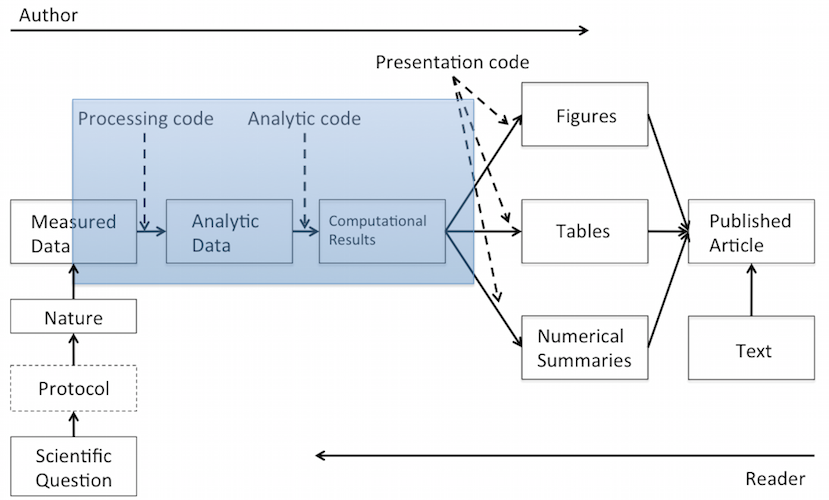

<style>
table.rmdtable th {
  color: white;
  font-size: 18px;
  background: -webkit-gradient(linear, 50% 0%, 50% 100%, color-stop(40%, #1e786d), color-stop(80%, #144f48)) no-repeat;
  background: -webkit-linear-gradient(top, #1e786d 40%, #144f48 80%) no-repeat;
  background: -moz-linear-gradient(top, #1e786d 40%, #144f48 80%) no-repeat;
  background: -o-linear-gradient(top, #1e786d 40%, #144f48 80%) no-repeat;
  background: linear-gradient(top, #1e786d 40%, #144f48 80%) no-repeat;
}
</style>

## Reproducible Research




## Reproducible Research in Practice {.build}

Research paper + set of supplimentary materials?

- processing code
- analytic code
- presentation code


**We can do better than that!**


## Dynamic Documents

$$
\left.
\begin{aligned}
    \text{Text} \quad\\ % use \quad as spacer between equation and right brace
    \text{Code} \quad
\end{aligned}
\right\} \quad combination \: process \quad \Rightarrow \quad \text{Paper}
$$

\
\
\
Dynamic documents integrate an **authoring language** and a **programming language**.


## Sweave

$$
\left.
\begin{aligned}
    \mathrm\LaTeX \quad\\ % use \quad as spacer between equation and right brace
    \text{R} \quad
\end{aligned}
\right\} \quad sweave \quad\Rightarrow\quad \text{Paper}
$$

\
\
\

Sweave is a tool that allows to embed  R code for complete data analyses in latex documents.

Sweave was created by *Friedrich Leisch*, Ludwig Maximilian Universität München


# R Markdown

## Rmarkdown

$$
\left.
\begin{aligned}
    \text{markdown} \quad\\ % use \quad as spacer between equation and right brace
    \text{R} \quad
\end{aligned}
\right\} \quad knitr \quad\Rightarrow\quad pandoc \quad\Rightarrow\quad \text{html, doc, pdf}
$$

\
\
\

[R Markdown](http://rmarkdown.rstudio.com) was created by the developers of RStudio.


## Advantages of R Markdown

>- Many available output formats including **HTML, PDF, and MS Word**.
>- Support for creating Beamer, ioslides, and Slidy **presentations**.
>- New markdown syntax including expanded support for **tables and bibliographies**.
>- Hooks for **customizing HTML and PDF output** (include CSS, headers, and footers).
>- Include **raw LaTeX** within markdown for advanced customization of PDF output and **equations**.


## Markdown Overview


## R Code Chunks


## R Markdown Help

- R Markdown Cheat Sheet
- R Markdown Reference Guide

\
\
\
[http://www.rstudio.com/resources/cheatsheets/](http://www.rstudio.com/resources/cheatsheets/)


# Knitr Chunk Options

## Knitr

$$
\left.
\begin{aligned}
    \text{markdown} \quad\\ % use \quad as spacer between equation and right brace
    \text{R} \quad
\end{aligned}
\right\} \quad \color{red}{knitr} \quad\Rightarrow\quad pandoc \quad\Rightarrow\quad \text{html, doc, pdf}
$$


## Simple Code Chunk

<pre class = 'prettyprint lang-r'>
    ```{r}`r ''`
    n = 10
    rnorm(n)
    ```
</pre>

```{r echo=FALSE}
n = 10
rnorm(n)
```

This chunk produces 10 random numbers.

## Chunk name

<pre class = 'prettyprint lang-r'>
    ```{r random}`r ''`
    n = 10
    rnorm(n)
    ```
</pre>

```{r echo=FALSE}
n = 10
rnorm(n)
```

It's good practice to label every code chunk.  
Here the label is "random".


## Chunk option

<pre class = 'prettyprint lang-r'>
    ```{r random echo=FALSE}`r ''`
    n = 10
    rnorm(n)
    ```
</pre>

"echo=FALSE" supresses the display of the code in the final document. However, the code is executed.


## Evaluate

<pre class = 'prettyprint lang-r'>
    ```{r random eval=FALSE}`r ''`
    n = 10
    rnorm(n)
    ```
</pre>

"eval=FALSE" displays code but does not execute it.


## Figures

<pre class = 'prettyprint lang-r'>
    ```{r histogram fig.height=4, fig.width=8} `r ''`
    x  <- rnorm(100)
    hist(x)
    ```
</pre>

```{r fig.height=4, fig.width=8, echo=FALSE}
x  <- rnorm(100)
hist(x)
```

## Suppress Warning, Error Messages {.smaller}

**error=FALSE**: knitr will not display any error messages generated by the code.

**message=FALSE**: knitr will not display any messages generated by the code.

**warning=FALSE**: knitr will not display any warning messages generated by the code.


# YAML

## YAML Header

$$
\left.
\begin{aligned}
    \text{markdown} \quad\\ % use \quad as spacer between equation and right brace
    \text{R} \quad
\end{aligned}
\right\} \quad knitr \quad\Rightarrow\quad \color{red}{pandoc} \quad\Rightarrow\quad \text{html, doc, pdf}
$$

The YAML header provides the controls for the pandoc document converter.


## Output: ioslides

<pre class = 'prettyprint lang-r'>
    ---
    title: "R Markdown"
    subtitle: "Master Seminar Quantitative Research Methods"
    author: Peter Putz
    date: Institut für Organisation und Globale Managementstudien, JKU Linz
    output: 
      ioslides_presentation:
        widescreen: true
        logo: ../../assets/img/JKUWappen.png
        css: ../../assets/css/jku.css
    ---
</pre>


## Output: MS Word

<pre class = 'prettyprint lang-r'>
    ---
    title: "Habits"
    output:
      word_document:
        fig_width: 5
        fig_height: 5
        fig_caption: true
    ---
</pre>


## Output: pdf

<pre class = 'prettyprint lang-r'>
    ---
    title: "Habits"
    author: John Doe
    date: March 22, 2005
    output: pdf_document
    ---
</pre>


**Note:** In order to render pdf files you need to install

- [MacTeX](https://tug.org/mactex/) (Mac OS)
- [MikTeX](http://miktex.org) (Windows OS)

Warning: These are mulitple GB downloads.
