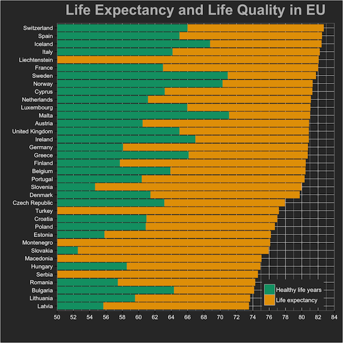

<!--
## Revised Schedule 266.018
  
| Date  | Time        | Room       | Topic                                                    |
|------:| ----------- | ---------- | ---------------------------------------------------------|
| 20.4. | 13:45—17:00 | MT 127     | Seminar overview, introduction to programming language R |                         
| 27.4. | 13:45—17:00 | MT 127     | Reproducible research, knitr                             |
| 11.5. | 13:45—17:00 | MT 127     | Exploratory data analysis, ggplot                        |
| 18.5. | 13:45—17:00 | MT 127     | ~~Statistical inference~~ **Exporatory Data Analysis 2** |
|  1.6. | 13:45—17:00 | MT 127     | ~~Regression models~~ **Statistical inference**          |
|  8.6. | 13:45—17:00 | MT 127     | Team Presentations                                       |
-->

## Revised Schedule 266.000
  
| Date  | Time        | Room       | Topic                                                    |
|------:| ----------- | ---------- | ---------------------------------------------------------|
| 22.4. | 13:45—17:00 | S2 059     | Seminar overview, introduction to programming language R |                         
| 29.4. | 13:45—17:00 | S2 059     | Reproducible research, knitr                             |
| 13.5. | 13:45—17:00 | HF 9905    | Exploratory data analysis, ggplot                        |
| 20.5. | 13:45—17:00 | HF 9905    | ~~Statistical inference~~ **Exporatory Data Analysis 2** |
|  3.6. | 13:45—17:00 | HF 9905    | ~~Regression models~~ **Statistical inference**          |
| 10.6. | 13:45—17:00 | HF 9905    | Team Presentations                                       |

----

## Today's Agenda

>- Last Assignment
>- Reading Data (locally and from the Internet)
>- Manipulating Data
>- Visualizing Data
>- Example

